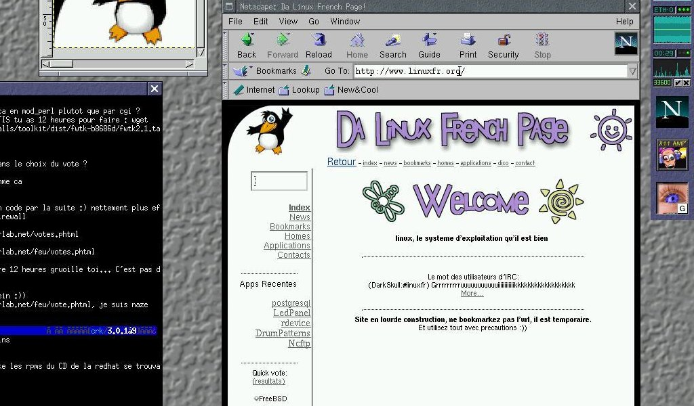
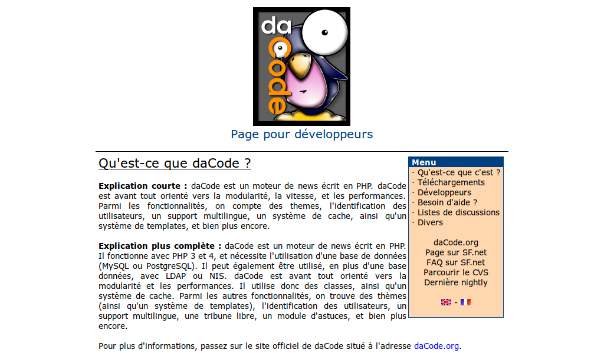
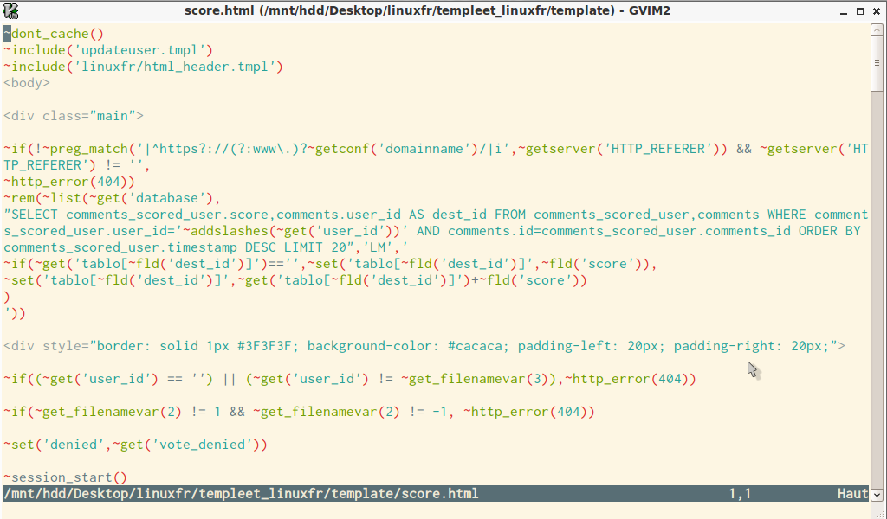
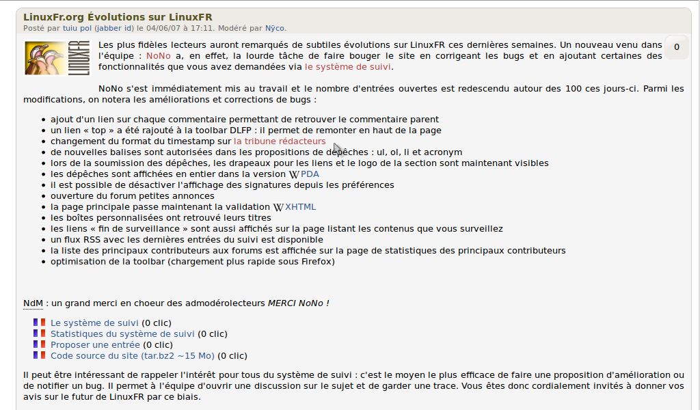
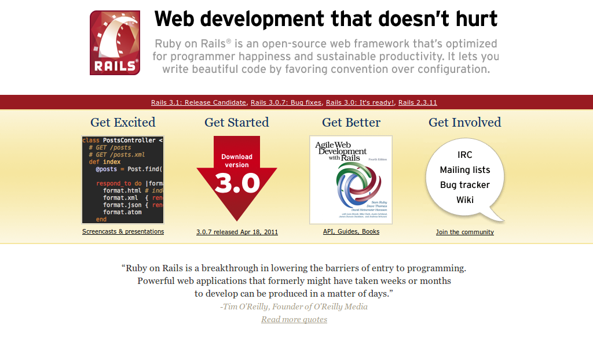
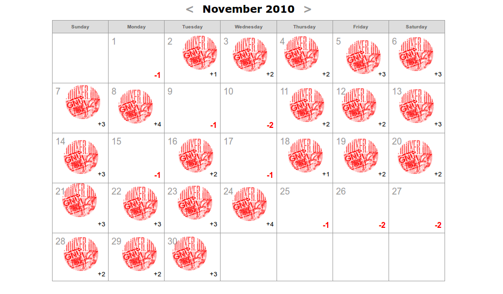
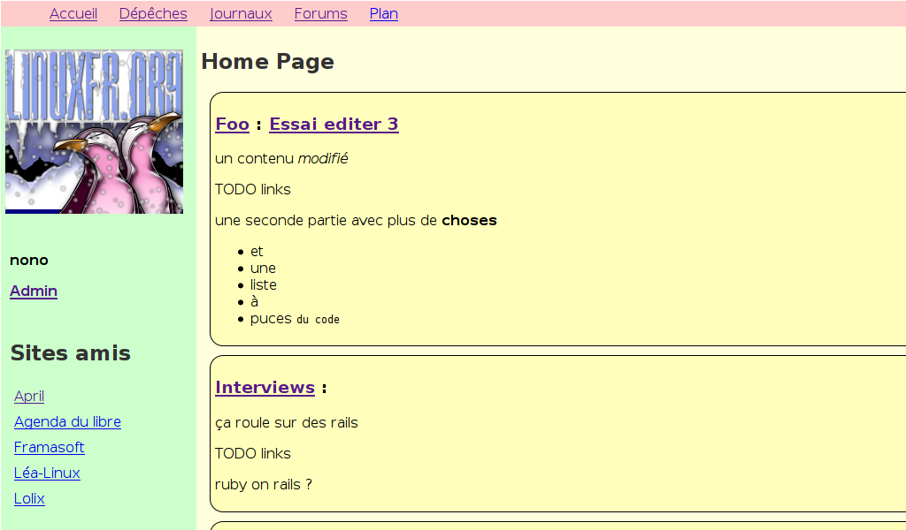
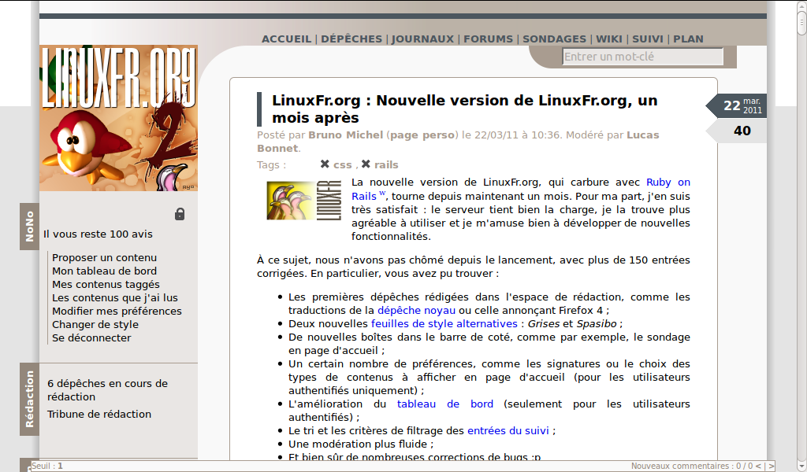
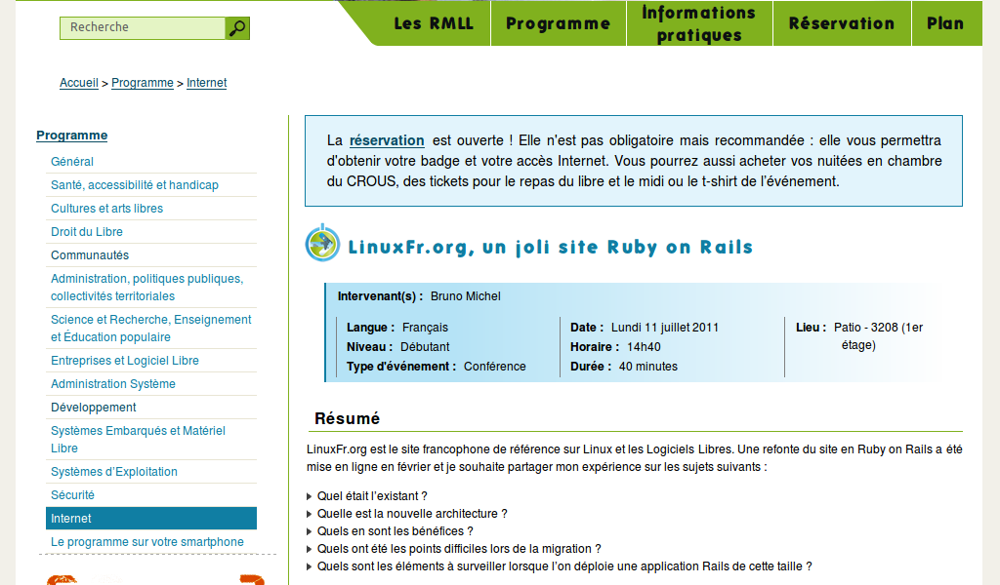

!SLIDE

# 28 juin 1998 #
## Naissance du site ##

!SLIDE

# Septembre 2000 #
## Passage à daCode ##

!SLIDE

# Octobre 2002 #
## Nouvelle version templeet ##

!SLIDE

# Mai/Juin 2007 #
## NoNo dans l'équipe ##

!SLIDE

# Octobre 2007 #
## Premières discussions ##

!SLIDE

# Janvier 2009 #
## Ma résolution ##

!SLIDE

# Janvier 2010 #
## Passage à Rails 3 ##

!SLIDE

# Octobre 2010 #
## Concours et Beta ##

!SLIDE

# 20 février 2011 #
## C'est en ligne ! ##

!SLIDE

# 11 juillet 2011 #
## Présentation aux RMLL ##

